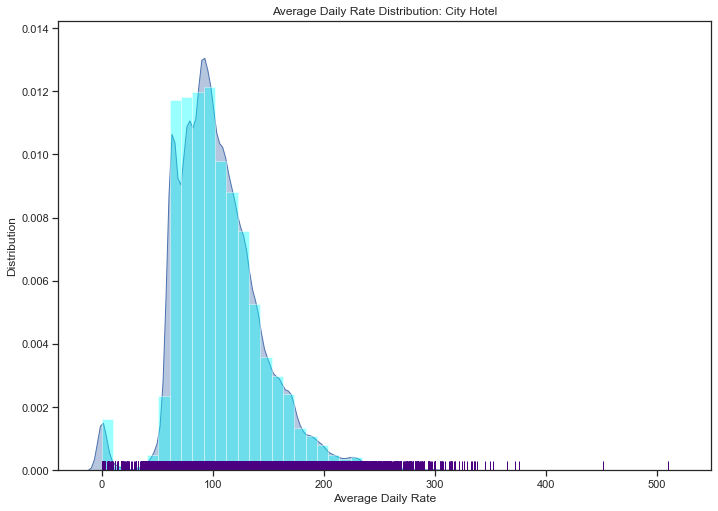
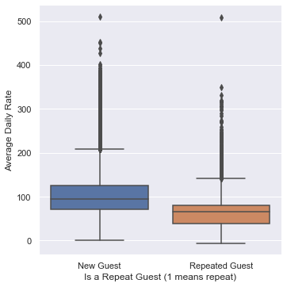
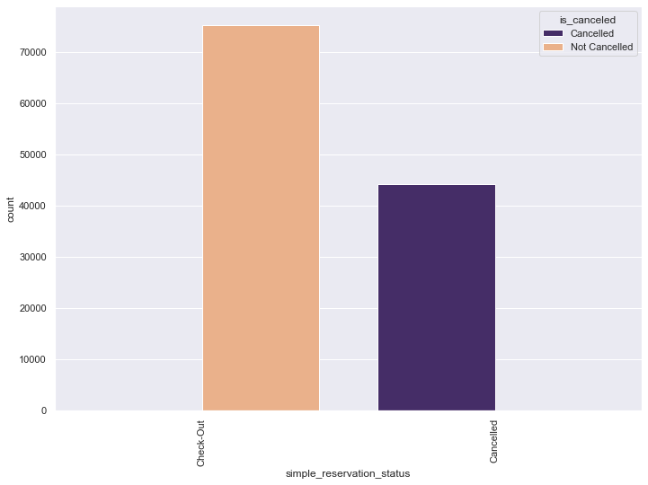

# Lab 1

### Imports

Note: if the imports don't work, try opening your command line and enter these commands

```
pip install -U pandas
pip install -U numpy
pip install -U matplotlib
pip install -U seaborn
```


```python
import pandas as pd
import numpy as np
import matplotlib.pyplot as plt
import seaborn as sns; sns.set(style="ticks", color_codes=True, rc={'figure.figsize':(11.7,8.27)})
from itertools import combinations
from sklearn import preprocessing as preproc
from sklearn.compose import ColumnTransformer
from sklearn.decomposition import PCA
from sklearn.model_selection import train_test_split 
from sklearn.linear_model import LogisticRegression
from sklearn.metrics import accuracy_score
from sklearn.metrics import confusion_matrix
from sklearn import preprocessing
```


```python
#class that mutes code output
#source: https://stackoverflow.com/questions/2828953/silence-the-stdout-of-a-function-in-python-without-trashing-sys-stdout-and-resto
import sys, traceback
class Suppressor(object):
    def __enter__(self):
        self.stdout = sys.stdout
        sys.stdout = self
    def __exit__(self, type, value, traceback):
        sys.stdout = self.stdout
        if type is not None:
    # Do normal exception handling
            def write(self, x): pass
```

### Data Sources

https://www.kaggle.com/jessemostipak/hotel-booking-demand

https://www.sciencedirect.com/science/article/pii/S2352340918315191


```python
df = pd.read_csv("../Data/hotel_bookings.csv")
df
```


<div>
<style scoped>
    .dataframe tbody tr th:only-of-type {
        vertical-align: middle;
    }

    .dataframe tbody tr th {
        vertical-align: top;
    }

    .dataframe thead th {
        text-align: right;
    }
</style>
<table border="1" class="dataframe">
  <thead>
    <tr style="text-align: right;">
      <th></th>
      <th>hotel</th>
      <th>is_canceled</th>
      <th>lead_time</th>
      <th>arrival_date_year</th>
      <th>arrival_date_month</th>
      <th>arrival_date_week_number</th>
      <th>arrival_date_day_of_month</th>
      <th>stays_in_weekend_nights</th>
      <th>stays_in_week_nights</th>
      <th>adults</th>
      <th>...</th>
      <th>deposit_type</th>
      <th>agent</th>
      <th>company</th>
      <th>days_in_waiting_list</th>
      <th>customer_type</th>
      <th>adr</th>
      <th>required_car_parking_spaces</th>
      <th>total_of_special_requests</th>
      <th>reservation_status</th>
      <th>reservation_status_date</th>
    </tr>
  </thead>
  <tbody>
    <tr>
      <th>0</th>
      <td>Resort Hotel</td>
      <td>0</td>
      <td>342</td>
      <td>2015</td>
      <td>July</td>
      <td>27</td>
      <td>1</td>
      <td>0</td>
      <td>0</td>
      <td>2</td>
      <td>...</td>
      <td>No Deposit</td>
      <td>NaN</td>
      <td>NaN</td>
      <td>0</td>
      <td>Transient</td>
      <td>0.00</td>
      <td>0</td>
      <td>0</td>
      <td>Check-Out</td>
      <td>7/1/2015</td>
    </tr>
    <tr>
      <th>1</th>
      <td>Resort Hotel</td>
      <td>0</td>
      <td>737</td>
      <td>2015</td>
      <td>July</td>
      <td>27</td>
      <td>1</td>
      <td>0</td>
      <td>0</td>
      <td>2</td>
      <td>...</td>
      <td>No Deposit</td>
      <td>NaN</td>
      <td>NaN</td>
      <td>0</td>
      <td>Transient</td>
      <td>0.00</td>
      <td>0</td>
      <td>0</td>
      <td>Check-Out</td>
      <td>7/1/2015</td>
    </tr>
    <tr>
      <th>2</th>
      <td>Resort Hotel</td>
      <td>0</td>
      <td>7</td>
      <td>2015</td>
      <td>July</td>
      <td>27</td>
      <td>1</td>
      <td>0</td>
      <td>1</td>
      <td>1</td>
      <td>...</td>
      <td>No Deposit</td>
      <td>NaN</td>
      <td>NaN</td>
      <td>0</td>
      <td>Transient</td>
      <td>75.00</td>
      <td>0</td>
      <td>0</td>
      <td>Check-Out</td>
      <td>7/2/2015</td>
    </tr>
    <tr>
      <th>3</th>
      <td>Resort Hotel</td>
      <td>0</td>
      <td>13</td>
      <td>2015</td>
      <td>July</td>
      <td>27</td>
      <td>1</td>
      <td>0</td>
      <td>1</td>
      <td>1</td>
      <td>...</td>
      <td>No Deposit</td>
      <td>304.0</td>
      <td>NaN</td>
      <td>0</td>
      <td>Transient</td>
      <td>75.00</td>
      <td>0</td>
      <td>0</td>
      <td>Check-Out</td>
      <td>7/2/2015</td>
    </tr>
    <tr>
      <th>4</th>
      <td>Resort Hotel</td>
      <td>0</td>
      <td>14</td>
      <td>2015</td>
      <td>July</td>
      <td>27</td>
      <td>1</td>
      <td>0</td>
      <td>2</td>
      <td>2</td>
      <td>...</td>
      <td>No Deposit</td>
      <td>240.0</td>
      <td>NaN</td>
      <td>0</td>
      <td>Transient</td>
      <td>98.00</td>
      <td>0</td>
      <td>1</td>
      <td>Check-Out</td>
      <td>7/3/2015</td>
    </tr>
    <tr>
      <th>...</th>
      <td>...</td>
      <td>...</td>
      <td>...</td>
      <td>...</td>
      <td>...</td>
      <td>...</td>
      <td>...</td>
      <td>...</td>
      <td>...</td>
      <td>...</td>
      <td>...</td>
      <td>...</td>
      <td>...</td>
      <td>...</td>
      <td>...</td>
      <td>...</td>
      <td>...</td>
      <td>...</td>
      <td>...</td>
      <td>...</td>
      <td>...</td>
    </tr>
    <tr>
      <th>119385</th>
      <td>City Hotel</td>
      <td>0</td>
      <td>23</td>
      <td>2017</td>
      <td>August</td>
      <td>35</td>
      <td>30</td>
      <td>2</td>
      <td>5</td>
      <td>2</td>
      <td>...</td>
      <td>No Deposit</td>
      <td>394.0</td>
      <td>NaN</td>
      <td>0</td>
      <td>Transient</td>
      <td>96.14</td>
      <td>0</td>
      <td>0</td>
      <td>Check-Out</td>
      <td>9/6/2017</td>
    </tr>
    <tr>
      <th>119386</th>
      <td>City Hotel</td>
      <td>0</td>
      <td>102</td>
      <td>2017</td>
      <td>August</td>
      <td>35</td>
      <td>31</td>
      <td>2</td>
      <td>5</td>
      <td>3</td>
      <td>...</td>
      <td>No Deposit</td>
      <td>9.0</td>
      <td>NaN</td>
      <td>0</td>
      <td>Transient</td>
      <td>225.43</td>
      <td>0</td>
      <td>2</td>
      <td>Check-Out</td>
      <td>9/7/2017</td>
    </tr>
    <tr>
      <th>119387</th>
      <td>City Hotel</td>
      <td>0</td>
      <td>34</td>
      <td>2017</td>
      <td>August</td>
      <td>35</td>
      <td>31</td>
      <td>2</td>
      <td>5</td>
      <td>2</td>
      <td>...</td>
      <td>No Deposit</td>
      <td>9.0</td>
      <td>NaN</td>
      <td>0</td>
      <td>Transient</td>
      <td>157.71</td>
      <td>0</td>
      <td>4</td>
      <td>Check-Out</td>
      <td>9/7/2017</td>
    </tr>
    <tr>
      <th>119388</th>
      <td>City Hotel</td>
      <td>0</td>
      <td>109</td>
      <td>2017</td>
      <td>August</td>
      <td>35</td>
      <td>31</td>
      <td>2</td>
      <td>5</td>
      <td>2</td>
      <td>...</td>
      <td>No Deposit</td>
      <td>89.0</td>
      <td>NaN</td>
      <td>0</td>
      <td>Transient</td>
      <td>104.40</td>
      <td>0</td>
      <td>0</td>
      <td>Check-Out</td>
      <td>9/7/2017</td>
    </tr>
    <tr>
      <th>119389</th>
      <td>City Hotel</td>
      <td>0</td>
      <td>205</td>
      <td>2017</td>
      <td>August</td>
      <td>35</td>
      <td>29</td>
      <td>2</td>
      <td>7</td>
      <td>2</td>
      <td>...</td>
      <td>No Deposit</td>
      <td>9.0</td>
      <td>NaN</td>
      <td>0</td>
      <td>Transient</td>
      <td>151.20</td>
      <td>0</td>
      <td>2</td>
      <td>Check-Out</td>
      <td>9/7/2017</td>
    </tr>
  </tbody>
</table>
<p>119390 rows × 32 columns</p>
</div>


## Business Understanding

* Purpose of data
    - Why was it collected?

According to the data source, the data was collected and published for purely academic reasons; the authors felt that real business data was scarce, and published the dataset in order to make it available for scientific and educational purposes. The journal article containing the dataset can be accessed at the following link: https://www.sciencedirect.com/science/article/pii/S2352340918315191

* How would we define and measure the outcomes? (How do we measure success of our findings?)

Our goal with this dataset is to predict the following outcome variables. First, can we predict whether a customer will be a repeat customer or not, and Second, can we predict whether a customer will be a no-show or cancel their room. If these predictions were possible then that would be valuable information for any hotel in their booking preparations, as they would then be able to prepare for those cancellations, no-shows, and repeat guests in advance.


* How do we measure effectiveness of a good prediction algorithm?

In order to fully test information usefulness and accuracy we expect to cross-validate the dataset using both internal cross-validation and train-and-test methods. Given that both of our target variables result in classification problems, we can validate these results by using precision and recall to generate an F1 score. Additionally we can use sensitivity and specificity as model qualtiy metrics. 


## Data Understanding

### Data Meaning Type
#### Describe the meaning and type of data for each attribute in the data file

The dataset has the data for two different hotels, one is Resort hotel and the other one is City hotel, both are located in Portugal. The date range of this data set is from 17 October 2014 to 31 August 2017. There are 32 attributies and total 119390 records. Detail information of each attribute can be found in this link :https://www.sciencedirect.com/science/article/pii/S2352340918315191. 


```python
dd = pd.read_csv("../Data/datadesc.csv")
dd
```


<div>
<style scoped>
    .dataframe tbody tr th:only-of-type {
        vertical-align: middle;
    }

    .dataframe tbody tr th {
        vertical-align: top;
    }

    .dataframe thead th {
        text-align: right;
    }
</style>
<table border="1" class="dataframe">
  <thead>
    <tr style="text-align: right;">
      <th></th>
      <th>Variable</th>
      <th>Type</th>
      <th>Description</th>
      <th>Value Range</th>
    </tr>
  </thead>
  <tbody>
    <tr>
      <th>0</th>
      <td>hotel</td>
      <td>categorical</td>
      <td>2 type of hotel</td>
      <td>resort hotel, city hotel</td>
    </tr>
    <tr>
      <th>1</th>
      <td>is_canceled</td>
      <td>categorical</td>
      <td>Value indicating if the booking was canceled (...</td>
      <td>the booking was canceled (1) or not (0)</td>
    </tr>
    <tr>
      <th>2</th>
      <td>lead_time</td>
      <td>integer</td>
      <td>Number of days that elapsed between the enteri...</td>
      <td>0-737</td>
    </tr>
    <tr>
      <th>3</th>
      <td>arrival_date_year</td>
      <td>integer</td>
      <td>Year of arrival date</td>
      <td>2015-2017</td>
    </tr>
    <tr>
      <th>4</th>
      <td>arrival_date_month</td>
      <td>categorical</td>
      <td>Month of arrival date with 12 categories: “Jan...</td>
      <td>January to December</td>
    </tr>
    <tr>
      <th>5</th>
      <td>arrival_date_week_number</td>
      <td>integer</td>
      <td>Week number of the arrival date</td>
      <td>1 to 4</td>
    </tr>
    <tr>
      <th>6</th>
      <td>arrival_date_day_of_month</td>
      <td>integer</td>
      <td>Day of the month of the arrival date</td>
      <td>1 to 31</td>
    </tr>
    <tr>
      <th>7</th>
      <td>stays_in_weekend_nights</td>
      <td>integer</td>
      <td>Number of weekend nights (Saturday or Sunday) ...</td>
      <td>Saturday or Sunday</td>
    </tr>
    <tr>
      <th>8</th>
      <td>stays_in_week_nights</td>
      <td>integer</td>
      <td>Number of week nights (Monday to Friday) the g...</td>
      <td>Monday to Friday</td>
    </tr>
    <tr>
      <th>9</th>
      <td>adults</td>
      <td>integer</td>
      <td>Number of adults</td>
      <td>0-55</td>
    </tr>
    <tr>
      <th>10</th>
      <td>children</td>
      <td>integer</td>
      <td>Number of children</td>
      <td>0-10</td>
    </tr>
    <tr>
      <th>11</th>
      <td>babies</td>
      <td>integer</td>
      <td>Number of babies</td>
      <td>0-10</td>
    </tr>
    <tr>
      <th>12</th>
      <td>meal</td>
      <td>categorical</td>
      <td>Type of meal booked. Categories are presented ...</td>
      <td>Undefined/SC – no meal package;\nBB – Bed &amp; Br...</td>
    </tr>
    <tr>
      <th>13</th>
      <td>country</td>
      <td>categorical</td>
      <td>Country of origin.</td>
      <td>180 unique values</td>
    </tr>
    <tr>
      <th>14</th>
      <td>market_segment</td>
      <td>categorical</td>
      <td>Market segment designation</td>
      <td>In categories, the term “TA” means “Travel Age...</td>
    </tr>
    <tr>
      <th>15</th>
      <td>distribution_channel</td>
      <td>categorical</td>
      <td>Booking distribution channel. The term “TA” me...</td>
      <td>The term “TA” means “Travel Agents” and “TO” m...</td>
    </tr>
    <tr>
      <th>16</th>
      <td>is_repeated_guest</td>
      <td>categorical</td>
      <td>Value indicating if the booking name was from ...</td>
      <td>repeated guest (1) or not (0)</td>
    </tr>
    <tr>
      <th>17</th>
      <td>previous_cancellations</td>
      <td>integer</td>
      <td>Number of previous bookings that were cancelle...</td>
      <td>0-26</td>
    </tr>
    <tr>
      <th>18</th>
      <td>previous_bookings_not_canceled</td>
      <td>integer</td>
      <td>Number of previous bookings not cancelled by t...</td>
      <td>0-72</td>
    </tr>
    <tr>
      <th>19</th>
      <td>reserved_room_type</td>
      <td>categorical</td>
      <td>Code of room type reserved. Code is presented ...</td>
      <td>A-P</td>
    </tr>
    <tr>
      <th>20</th>
      <td>assigned_room_type</td>
      <td>categorical</td>
      <td>Code for the type of room assigned to the book...</td>
      <td>A-P</td>
    </tr>
    <tr>
      <th>21</th>
      <td>booking_changes</td>
      <td>integer</td>
      <td>Number of changes/amendments made to the booki...</td>
      <td>0-18, 20, 21</td>
    </tr>
    <tr>
      <th>22</th>
      <td>deposit_type</td>
      <td>categorical</td>
      <td>Indication on if the customer made a deposit t...</td>
      <td>No deposit, non refund, refundable</td>
    </tr>
    <tr>
      <th>23</th>
      <td>agents</td>
      <td>categorical</td>
      <td>ID of the travel agency that made the bookinga</td>
      <td>1-535</td>
    </tr>
    <tr>
      <th>24</th>
      <td>company</td>
      <td>categorical</td>
      <td>ID of the company/entity that made the booking...</td>
      <td>6-543</td>
    </tr>
    <tr>
      <th>25</th>
      <td>days_in_waiting_list</td>
      <td>integer</td>
      <td>Number of days the booking was in the waiting ...</td>
      <td>0-391</td>
    </tr>
    <tr>
      <th>26</th>
      <td>customer_type</td>
      <td>categorical</td>
      <td>Type of booking</td>
      <td>Contract - when the booking has an allotment o...</td>
    </tr>
    <tr>
      <th>27</th>
      <td>adr</td>
      <td>numeric</td>
      <td>Average Daily Rate</td>
      <td>Calculated by dividing the sum of all lodging...</td>
    </tr>
    <tr>
      <th>28</th>
      <td>required_car_parking_spaces</td>
      <td>integer</td>
      <td>Number of car parking spaces required by the c...</td>
      <td>0-3, 8</td>
    </tr>
    <tr>
      <th>29</th>
      <td>total_of_special_requests</td>
      <td>integer</td>
      <td>Number of special requests made by the custome...</td>
      <td>0-5</td>
    </tr>
    <tr>
      <th>30</th>
      <td>reservation_status</td>
      <td>categorical</td>
      <td>Reservation last status</td>
      <td>Canceled – booking was canceled by the custome...</td>
    </tr>
    <tr>
      <th>31</th>
      <td>reservation_status_date</td>
      <td>date</td>
      <td>Date at which the last status was set.</td>
      <td>2014/10/17- 2017/09/14</td>
    </tr>
  </tbody>
</table>
</div>


### Data Quality 


```python
df.isnull().sum()
```


    hotel                                  0
    is_canceled                            0
    lead_time                              0
    arrival_date_year                      0
    arrival_date_month                     0
    arrival_date_week_number               0
    arrival_date_day_of_month              0
    stays_in_weekend_nights                0
    stays_in_week_nights                   0
    adults                                 0
    children                               4
    babies                                 0
    meal                                   0
    country                              488
    market_segment                         0
    distribution_channel                   0
    is_repeated_guest                      0
    previous_cancellations                 0
    previous_bookings_not_canceled         0
    reserved_room_type                     0
    assigned_room_type                     0
    booking_changes                        0
    deposit_type                           0
    agent                              16340
    company                           112593
    days_in_waiting_list                   0
    customer_type                          0
    adr                                    0
    required_car_parking_spaces            0
    total_of_special_requests              0
    reservation_status                     0
    reservation_status_date                0
    dtype: int64


There are 488 missing value in the attribute of country, 16340 missing value in the attribute of agent, 112593 missing value in the attribute of company, and 4 missing value in the children. 

   We will put "unknown" for the missing value in the column of country because if its missing from the dataset it means customer did not provide that information; replace missing value in agent and company with 0, because these two are optional for customers, company means if the hotel room was booked by company or not, if the customer booked hotel room from a travel agent or not; delete the 4 record of missing value in the children column, because compare to total 119386 records it is really minimum, it will not hurt by deleting these 4 records. 

There is one outlier got removed is from column adr value is 5400 because adr is average daily rate, the mean of this column is 101.83 with that outlier value might affect the data. 


```python
#replace missing values in certain columns
#source: https://datatofish.com/replace-nan-values-with-zeros/
df['children'] = df['children'].fillna(0)
df['country'] = df['country'].fillna("unknown")
df['agent'] = df['agent'].fillna(0)
df['company'] = df['company'].fillna(0)
```

Replace the binary columns with strings so they are more readable during our analysis.


```python
mapper = {0:"Not Cancelled", 1:"Cancelled"}
df['is_canceled'] = df['is_canceled'].replace(mapper)

mapper = {0:"New Guest", 1:"Repeated Guest"}
df['is_repeated_guest'] = df['is_repeated_guest'].replace(mapper)
```

### Simple Statistics


```python
df.describe()
```


<div>
<style scoped>
    .dataframe tbody tr th:only-of-type {
        vertical-align: middle;
    }

    .dataframe tbody tr th {
        vertical-align: top;
    }

    .dataframe thead th {
        text-align: right;
    }
</style>
<table border="1" class="dataframe">
  <thead>
    <tr style="text-align: right;">
      <th></th>
      <th>is_canceled</th>
      <th>lead_time</th>
      <th>arrival_date_year</th>
      <th>arrival_date_week_number</th>
      <th>arrival_date_day_of_month</th>
      <th>stays_in_weekend_nights</th>
      <th>stays_in_week_nights</th>
      <th>adults</th>
      <th>children</th>
      <th>babies</th>
      <th>is_repeated_guest</th>
      <th>previous_cancellations</th>
      <th>previous_bookings_not_canceled</th>
      <th>booking_changes</th>
      <th>agent</th>
      <th>company</th>
      <th>days_in_waiting_list</th>
      <th>adr</th>
      <th>required_car_parking_spaces</th>
      <th>total_of_special_requests</th>
    </tr>
  </thead>
  <tbody>
    <tr>
      <th>count</th>
      <td>119390.000000</td>
      <td>119390.000000</td>
      <td>119390.000000</td>
      <td>119390.000000</td>
      <td>119390.000000</td>
      <td>119390.000000</td>
      <td>119390.000000</td>
      <td>119390.000000</td>
      <td>119390.000000</td>
      <td>119390.000000</td>
      <td>119390.000000</td>
      <td>119390.000000</td>
      <td>119390.000000</td>
      <td>119390.000000</td>
      <td>119390.000000</td>
      <td>119390.000000</td>
      <td>119390.000000</td>
      <td>119390.000000</td>
      <td>119390.000000</td>
      <td>119390.000000</td>
    </tr>
    <tr>
      <th>mean</th>
      <td>0.370416</td>
      <td>104.011416</td>
      <td>2016.156554</td>
      <td>27.165173</td>
      <td>15.798241</td>
      <td>0.927599</td>
      <td>2.500302</td>
      <td>1.856403</td>
      <td>0.103886</td>
      <td>0.007949</td>
      <td>0.031912</td>
      <td>0.087118</td>
      <td>0.137097</td>
      <td>0.221124</td>
      <td>74.828319</td>
      <td>10.775157</td>
      <td>2.321149</td>
      <td>101.831122</td>
      <td>0.062518</td>
      <td>0.571363</td>
    </tr>
    <tr>
      <th>std</th>
      <td>0.482918</td>
      <td>106.863097</td>
      <td>0.707476</td>
      <td>13.605138</td>
      <td>8.780829</td>
      <td>0.998613</td>
      <td>1.908286</td>
      <td>0.579261</td>
      <td>0.398555</td>
      <td>0.097436</td>
      <td>0.175767</td>
      <td>0.844336</td>
      <td>1.497437</td>
      <td>0.652306</td>
      <td>107.141953</td>
      <td>53.943884</td>
      <td>17.594721</td>
      <td>50.535790</td>
      <td>0.245291</td>
      <td>0.792798</td>
    </tr>
    <tr>
      <th>min</th>
      <td>0.000000</td>
      <td>0.000000</td>
      <td>2015.000000</td>
      <td>1.000000</td>
      <td>1.000000</td>
      <td>0.000000</td>
      <td>0.000000</td>
      <td>0.000000</td>
      <td>0.000000</td>
      <td>0.000000</td>
      <td>0.000000</td>
      <td>0.000000</td>
      <td>0.000000</td>
      <td>0.000000</td>
      <td>0.000000</td>
      <td>0.000000</td>
      <td>0.000000</td>
      <td>-6.380000</td>
      <td>0.000000</td>
      <td>0.000000</td>
    </tr>
    <tr>
      <th>25%</th>
      <td>0.000000</td>
      <td>18.000000</td>
      <td>2016.000000</td>
      <td>16.000000</td>
      <td>8.000000</td>
      <td>0.000000</td>
      <td>1.000000</td>
      <td>2.000000</td>
      <td>0.000000</td>
      <td>0.000000</td>
      <td>0.000000</td>
      <td>0.000000</td>
      <td>0.000000</td>
      <td>0.000000</td>
      <td>7.000000</td>
      <td>0.000000</td>
      <td>0.000000</td>
      <td>69.290000</td>
      <td>0.000000</td>
      <td>0.000000</td>
    </tr>
    <tr>
      <th>50%</th>
      <td>0.000000</td>
      <td>69.000000</td>
      <td>2016.000000</td>
      <td>28.000000</td>
      <td>16.000000</td>
      <td>1.000000</td>
      <td>2.000000</td>
      <td>2.000000</td>
      <td>0.000000</td>
      <td>0.000000</td>
      <td>0.000000</td>
      <td>0.000000</td>
      <td>0.000000</td>
      <td>0.000000</td>
      <td>9.000000</td>
      <td>0.000000</td>
      <td>0.000000</td>
      <td>94.575000</td>
      <td>0.000000</td>
      <td>0.000000</td>
    </tr>
    <tr>
      <th>75%</th>
      <td>1.000000</td>
      <td>160.000000</td>
      <td>2017.000000</td>
      <td>38.000000</td>
      <td>23.000000</td>
      <td>2.000000</td>
      <td>3.000000</td>
      <td>2.000000</td>
      <td>0.000000</td>
      <td>0.000000</td>
      <td>0.000000</td>
      <td>0.000000</td>
      <td>0.000000</td>
      <td>0.000000</td>
      <td>152.000000</td>
      <td>0.000000</td>
      <td>0.000000</td>
      <td>126.000000</td>
      <td>0.000000</td>
      <td>1.000000</td>
    </tr>
    <tr>
      <th>max</th>
      <td>1.000000</td>
      <td>737.000000</td>
      <td>2017.000000</td>
      <td>53.000000</td>
      <td>31.000000</td>
      <td>19.000000</td>
      <td>50.000000</td>
      <td>55.000000</td>
      <td>10.000000</td>
      <td>10.000000</td>
      <td>1.000000</td>
      <td>26.000000</td>
      <td>72.000000</td>
      <td>21.000000</td>
      <td>535.000000</td>
      <td>543.000000</td>
      <td>391.000000</td>
      <td>5400.000000</td>
      <td>8.000000</td>
      <td>5.000000</td>
    </tr>
  </tbody>
</table>
</div>


```python
#source: 02. DataVisualization
print (df.dtypes)
print (df.info())
```

    hotel                              object
    is_canceled                         int64
    lead_time                           int64
    arrival_date_year                   int64
    arrival_date_month                 object
    arrival_date_week_number            int64
    arrival_date_day_of_month           int64
    stays_in_weekend_nights             int64
    stays_in_week_nights                int64
    adults                              int64
    children                          float64
    babies                              int64
    meal                               object
    country                            object
    market_segment                     object
    distribution_channel               object
    is_repeated_guest                   int64
    previous_cancellations              int64
    previous_bookings_not_canceled      int64
    reserved_room_type                 object
    assigned_room_type                 object
    booking_changes                     int64
    deposit_type                       object
    agent                             float64
    company                           float64
    days_in_waiting_list                int64
    customer_type                      object
    adr                               float64
    required_car_parking_spaces         int64
    total_of_special_requests           int64
    reservation_status                 object
    reservation_status_date            object
    dtype: object
    <class 'pandas.core.frame.DataFrame'>
    RangeIndex: 119390 entries, 0 to 119389
    Data columns (total 32 columns):
     #   Column                          Non-Null Count   Dtype  
    ---  ------                          --------------   -----  
     0   hotel                           119390 non-null  object 
     1   is_canceled                     119390 non-null  int64  
     2   lead_time                       119390 non-null  int64  
     3   arrival_date_year               119390 non-null  int64  
     4   arrival_date_month              119390 non-null  object 
     5   arrival_date_week_number        119390 non-null  int64  
     6   arrival_date_day_of_month       119390 non-null  int64  
     7   stays_in_weekend_nights         119390 non-null  int64  
     8   stays_in_week_nights            119390 non-null  int64  
     9   adults                          119390 non-null  int64  
     10  children                        119390 non-null  float64
     11  babies                          119390 non-null  int64  
     12  meal                            119390 non-null  object 
     13  country                         119390 non-null  object 
     14  market_segment                  119390 non-null  object 
     15  distribution_channel            119390 non-null  object 
     16  is_repeated_guest               119390 non-null  int64  
     17  previous_cancellations          119390 non-null  int64  
     18  previous_bookings_not_canceled  119390 non-null  int64  
     19  reserved_room_type              119390 non-null  object 
     20  assigned_room_type              119390 non-null  object 
     21  booking_changes                 119390 non-null  int64  
     22  deposit_type                    119390 non-null  object 
     23  agent                           119390 non-null  float64
     24  company                         119390 non-null  float64
     25  days_in_waiting_list            119390 non-null  int64  
     26  customer_type                   119390 non-null  object 
     27  adr                             119390 non-null  float64
     28  required_car_parking_spaces     119390 non-null  int64  
     29  total_of_special_requests       119390 non-null  int64  
     30  reservation_status              119390 non-null  object 
     31  reservation_status_date         119390 non-null  object 
    dtypes: float64(4), int64(16), object(12)
    memory usage: 29.1+ MB
    None
    


```python
df.boxplot(column = ["lead_time", "stays_in_weekend_nights", "stays_in_week_nights","adults","children", "babies","previous_cancellations",
                     "previous_bookings_not_canceled","booking_changes","days_in_waiting_list","adr"],  vert= False, widths= 1)
```


    <AxesSubplot:>


    

    


The above box plots represent the distributions of each feature. Note the outlier which is set at \\$5400 for average daily rate, and the next highest value is \\$510. These values are drawn from the same hotel. We cannot automatically assume that the \\$5400 figure is meant to be \\$540, despite the fact that it would still be the highest rate in the dataset. Given this information it is safe to treat this value as an outlier and it will be removed from the analysis.


```python
#remove 5400 outlier from average daily rate
#source: https://www.delftstack.com/howto/python-pandas/how-to-delete-dataframe-row-in-pandas-based-on-column-value/
indexNames = df[ df['adr'] == 5400 ].index
df.drop(indexNames , inplace=True)
```

Lets look at the distribution of entries per country in this data


```python
df.country.value_counts(normalize= True)[:10]
#reference "https://www.kaggle.com/shrutidandagi/hotel-booking-demand-eda-data-visualisation"
```


    PRT    0.406981
    GBR    0.101592
    FRA    0.087236
    ESP    0.071765
    DEU    0.061036
    ITA    0.031544
    IRL    0.028269
    BEL    0.019617
    BRA    0.018628
    NLD    0.017623
    Name: country, dtype: float64


```python
df.country.value_counts(normalize= True)[-10:]
```


    NAM    0.000008
    PLW    0.000008
    DMA    0.000008
    NPL    0.000008
    BFA    0.000008
    AIA    0.000008
    FJI    0.000008
    NIC    0.000008
    PYF    0.000008
    LCA    0.000008
    Name: country, dtype: float64


Looks like Portugal has over 40% whiche make sense because these two hotels are located in Portugal; 10% from Great Britian, 8% from France. 


```python
df.reservation_status.value_counts(normalize= True)
```


    Check-Out    0.629589
    Canceled     0.360301
    No-Show      0.010110
    Name: reservation_status, dtype: float64


From the result above, we can see that there are 36% booking got canceled, 1% no-show is not too bad. 


```python
df.is_repeated_guest.value_counts(normalize = True)
```


    0    0.968088
    1    0.031912
    Name: is_repeated_guest, dtype: float64


96% of customers are first time customer only 3% of customers are repeated customer. This may pose challenges when trying to identify what factors influence repeat customers.


```python
df.is_canceled.value_counts(normalize= True)
```


    0    0.629589
    1    0.370411
    Name: is_canceled, dtype: float64


Almost 63% of bookings did not get canceled, the cancelation rate is 37%. 

### Visualize Attributes


```python
#Jules, Attribute Visualization
#plot: https://seaborn.pydata.org/generated/seaborn.distplot.html
#axis labels: https://stackoverflow.com/questions/31632637/label-axes-on-seaborn-barplot
#rug and density options: https://python-graph-gallery.com/21-control-rug-and-density-on-seaborn-histogram/
#suppressor function call from custom suppressor class: https://stackoverflow.com/questions/2828953/silence-the-stdout-of-a-function-in-python-without-trashing-sys-stdout-and-resto
sns.distplot(df['adr'], rug=True, 
             rug_kws={"color":"indigo", "height":0.02}, 
             hist_kws={"color":"purple"}, 
             kde_kws={"color":"b", "alpha":0.4, "shade":True})
plt.xlabel("Average Daily Rate")
plt.ylabel("Distribution")
with Suppressor():
    plt.title("Average Daily Rate Distribution")
```

    C:\Users\Jules\anaconda3\lib\site-packages\seaborn\distributions.py:2551: FutureWarning: `distplot` is a deprecated function and will be removed in a future version. Please adapt your code to use either `displot` (a figure-level function with similar flexibility) or `histplot` (an axes-level function for histograms).
      warnings.warn(msg, FutureWarning)
    C:\Users\Jules\anaconda3\lib\site-packages\seaborn\distributions.py:2055: FutureWarning: The `axis` variable is no longer used and will be removed. Instead, assign variables directly to `x` or `y`.
      warnings.warn(msg, FutureWarning)
    


    

    


```python
#Jules, Attribute Visualization
#plot: https://seaborn.pydata.org/generated/seaborn.boxplot.html
#axis labels: https://stackoverflow.com/questions/31632637/label-axes-on-seaborn-barplot
#suppressor function call from custom suppressor class: https://stackoverflow.com/questions/2828953/silence-the-stdout-of-a-function-in-python-without-trashing-sys-stdout-and-resto
sns.boxplot(x=df['adr'], color="purple")
plt.xlabel("Average Daily Rate")
plt.ylabel("Distribution")
with Suppressor():
    plt.title("Average Daily Rate Distribution")
```


    

    


The plots look a lot better without the outlier. The data still shows heavy right skew and a log transformation should be considered to normalize the distribution of the data. As a side note, the density plot has three components: a histogram, a density curve, and a rug plot which shows where the points lie on the graph.

We can see that the average daily rate for both hotels is between \\$90 and \\$100. A box plot and density plot are appropriate for the data because it shows expected mean rates and the year-round distribution of average daily rates, which can be helpful in calculating expected profits.


(escaping a dollar sign: https://stackoverflow.com/questions/16089089/escaping-dollar-sign-in-ipython-notebook)


```python
#divide data up into city hotel vs resort hotel
#source: https://stackoverflow.com/questions/12096252/use-a-list-of-values-to-select-rows-from-a-pandas-dataframe
#code adapted, .isin() replaced by ==
df_resort=df[df['hotel']=='Resort Hotel']
df_city=df[df['hotel']=='City Hotel']
```


```python
#Jules, Attribute Visualization
#plot: https://seaborn.pydata.org/generated/seaborn.distplot.html
#axis labels: https://stackoverflow.com/questions/31632637/label-axes-on-seaborn-barplot
#rug and density options: https://python-graph-gallery.com/21-control-rug-and-density-on-seaborn-histogram/
#suppressor function call from custom suppressor class: https://stackoverflow.com/questions/2828953/silence-the-stdout-of-a-function-in-python-without-trashing-sys-stdout-and-resto
sns.distplot(df_city['adr'], rug=True, 
             rug_kws={"color":"indigo", "height":0.02}, 
             hist_kws={"color":"cyan"}, 
             kde_kws={"color":"b", "alpha":0.4, "shade":True})
plt.xlabel("Average Daily Rate")
plt.ylabel("Distribution")
with Suppressor():
    plt.title("Average Daily Rate Distribution: City Hotel")

```

    C:\Users\Jules\anaconda3\lib\site-packages\seaborn\distributions.py:2551: FutureWarning: `distplot` is a deprecated function and will be removed in a future version. Please adapt your code to use either `displot` (a figure-level function with similar flexibility) or `histplot` (an axes-level function for histograms).
      warnings.warn(msg, FutureWarning)
    C:\Users\Jules\anaconda3\lib\site-packages\seaborn\distributions.py:2055: FutureWarning: The `axis` variable is no longer used and will be removed. Instead, assign variables directly to `x` or `y`.
      warnings.warn(msg, FutureWarning)
    


    

    


```python
#Jules, Attribute Visualization
#plot: https://seaborn.pydata.org/generated/seaborn.distplot.html
#axis labels: https://stackoverflow.com/questions/31632637/label-axes-on-seaborn-barplot
#rug and density options: https://python-graph-gallery.com/21-control-rug-and-density-on-seaborn-histogram/
#suppressor function call from custom suppressor class: https://stackoverflow.com/questions/2828953/silence-the-stdout-of-a-function-in-python-without-trashing-sys-stdout-and-resto
sns.distplot(df_resort['adr'], rug=True, 
             rug_kws={"color":"indigo", "height":0.02}, 
             hist_kws={"color":"fuchsia"}, 
             kde_kws={"color":"b", "alpha":0.4, "shade":True})
plt.xlabel("Average Daily Rate")
plt.ylabel("Distribution")
with Suppressor():
    plt.title("Average Daily Rate Distribution: Resort Hotel")
```

    C:\Users\Jules\anaconda3\lib\site-packages\seaborn\distributions.py:2551: FutureWarning: `distplot` is a deprecated function and will be removed in a future version. Please adapt your code to use either `displot` (a figure-level function with similar flexibility) or `histplot` (an axes-level function for histograms).
      warnings.warn(msg, FutureWarning)
    C:\Users\Jules\anaconda3\lib\site-packages\seaborn\distributions.py:2055: FutureWarning: The `axis` variable is no longer used and will be removed. Instead, assign variables directly to `x` or `y`.
      warnings.warn(msg, FutureWarning)
    


    

    


The fuchsia and cyan density plots above represent the average daily rate by hotel type. Cyan represents the city hotel and fuchsia representing the resort hotel. Interpreting the data is much the same as with the combined graph, but it becomes easier when the two distributions are combined into one graph (shown in the below cell). It is appropriate to break the data into a comparison between the city hotel and the resort hotel in order to compare revenues.


```python
#pull out values where adr==0
#source: https://stackoverflow.com/questions/12096252/use-a-list-of-values-to-select-rows-from-a-pandas-dataframe
#code adapted, .isin() replaced by ==
df_freeroom=df[df['adr']==0]
```


```python
#Jules, joint attribute analysis
#plot: https://cmdlinetips.com/2019/02/how-to-make-histogram-in-python-with-pandas-and-seaborn/
#axis labels: https://stackoverflow.com/questions/31632637/label-axes-on-seaborn-barplot
#suppressor function call from custom suppressor class: https://stackoverflow.com/questions/2828953/silence-the-stdout-of-a-function-in-python-without-trashing-sys-stdout-and-resto
sns.distplot(df_freeroom['total_of_special_requests'], kde=False,  
             hist_kws={"color":"purple"})
with Suppressor():
    plt.xlabel("Total Special Requests")
    plt.ylabel("Count")
    plt.title("Special Requests from Free Rooms")
```

    C:\Users\Jules\anaconda3\lib\site-packages\seaborn\distributions.py:2551: FutureWarning: `distplot` is a deprecated function and will be removed in a future version. Please adapt your code to use either `displot` (a figure-level function with similar flexibility) or `histplot` (an axes-level function for histograms).
      warnings.warn(msg, FutureWarning)
    


    

    


```python
#create total stay length df
df['total_stay_length'] = df['stays_in_weekend_nights']+df['stays_in_week_nights']
```


```python
#Jules, attribute visualization
#plot: https://cmdlinetips.com/2019/02/how-to-make-histogram-in-python-with-pandas-and-seaborn/
#axis labels: https://stackoverflow.com/questions/31632637/label-axes-on-seaborn-barplot
#tickmarks: https://stackoverflow.com/questions/12608788/changing-the-tick-frequency-on-x-or-y-axis-in-matplotlib
#suppressor function call from custom suppressor class: https://stackoverflow.com/questions/2828953/silence-the-stdout-of-a-function-in-python-without-trashing-sys-stdout-and-resto
sns.distplot(df['total_stay_length'], kde=False,  
             hist_kws={"color":"purple"})
plt.xlabel("Number of nights")
plt.ylabel("Count of observations")
plt.title("Count of Bookings Grouped by Stay Length")
with Suppressor():
    plt.xticks(np.arange(min(df['total_stay_length']), max(df['total_stay_length'])+1, 3.0))
```


    

    


```python
#Jules, Attribute Visualization
#plot: https://seaborn.pydata.org/generated/seaborn.boxplot.html
#axis labels: https://stackoverflow.com/questions/31632637/label-axes-on-seaborn-barplot
#tickmarks: https://stackoverflow.com/questions/12608788/changing-the-tick-frequency-on-x-or-y-axis-in-matplotlib
#suppressor function call from custom suppressor class: https://stackoverflow.com/questions/2828953/silence-the-stdout-of-a-function-in-python-without-trashing-sys-stdout-and-resto
sns.boxplot(x=df['total_stay_length'], color="purple")
plt.xlabel("Average Daily Rate")
plt.ylabel("Distribution")
with Suppressor():
    plt.title("Total Stay Length Distribution")
    plt.xticks(np.arange(min(df['total_stay_length']), max(df['total_stay_length'])+1, 3))
```


    

    


The histogram above is a visualization of total stay length of bookings. The graph is arranged as counts of bookings grouped by number of nights for both hotels. The graph shows evidence that any given customer is most likely to stay for three nights before checking out, and that the vast majority stay for three nights or less. This is valuable information for the hotels as room turndown service is required after every checkout in order to prepare the room for the next customer. The data is heavily right-skewed, with some customers staying up to 69 days. That would mean that hotels can expect some reliable business from extended stay customers. It may be worthwhile to do a log transformation on this column if it is going to be used in logistic regression.


```python
#Jules, Attribute Visualization
#source: https://seaborn.pydata.org/generated/seaborn.barplot.html
#palette: http://seaborn.pydata.org/tutorial/color_palettes.html
#top 10: https://stackoverflow.com/questions/32891211/limit-the-number-of-groups-shown-in-seaborn-countplot
#reversed color palette: https://stackoverflow.com/questions/30105541/creating-a-dark-reversed-color-palette-in-seaborn
with Suppressor():   
    sns.countplot(x="agent", data=df, color="purple", alpha=0.5, order=df.agent.value_counts().iloc[:10].index)

    plt.xlabel("Country Code")
    plt.ylabel("Count of observations")
    plt.title("Count of Bookings by Travel Agent")
```


    

    


The above count plot is counts of hotel bookings by travel agency. It is interesting to see that customers are so reliant on travel agencies for booking stays at hotels. Each number represents a specific travel agency code, and 0.0 is the category for customers not using a travel agency to book stays at hotels. Customers are using travel agency 9 so often that the ratio of travel agency 9 to no travel agency is 2:1! And the second most used travel agency, code 240, almost keeps pace with customers not using a travel agency.

This would give the hotels an idea of which travel agency they should rely and focus on for revenue sources. As usual, it makes sense to divide the data by hotel type.


```python
#Jules, Attribute Visualization
#source: https://seaborn.pydata.org/generated/seaborn.barplot.html
#palette: http://seaborn.pydata.org/tutorial/color_palettes.html
#top 10: https://stackoverflow.com/questions/32891211/limit-the-number-of-groups-shown-in-seaborn-countplot
#colors by hotel: https://seaborn.pydata.org/tutorial/categorical.html?highlight=color%20bar
with Suppressor():   
    sns.countplot(x="agent", data=df, hue="hotel", alpha=0.5,
                  order=df.agent.value_counts().iloc[:10].index,
                 palette={"City Hotel": "cyan", "Resort Hotel": "fuchsia"})

    plt.xlabel("Country Code")
    plt.ylabel("Count of observations")
    plt.title("Count of Bookings by Travel Agent and Hotel")
```


    

    


The above graph is the top 10 travel agents, with a breakdown of hotel type. The only common sources are 0, which is approximately equal for both hotels and represents no travel agency used in booking, and travel agent 6 which does most of its business with the city hotel and a small amount of business with the resort hotel. This graph is useful for showing travel agency sources for both hotels, and to show which agents each hotel should rely and focus on for revenue sources.

### Explore Joint Attributes


```python
#source: https://cmdlinetips.com/2018/04/how-to-drop-one-or-more-columns-in-pandas-dataframe/
df_num = df.drop(["hotel", "is_canceled", "arrival_date_month", "arrival_date_year",
                  "meal",
                  "country", "market_segment", "distribution_channel",
                  "reserved_room_type", 
                  "assigned_room_type", "deposit_type", "agent", "company", 
                  "customer_type", "reservation_status", 
                  "reservation_status_date"], axis=1)
```


```python
numerics = df_num.columns.tolist()
df_num_first_half = df_num[numerics[:8]]
df_num_first_half['is_cancelled'] = df_num['is_cancelled']
```

    <ipython-input-151-61b3e18f8369>:3: SettingWithCopyWarning: 
    A value is trying to be set on a copy of a slice from a DataFrame.
    Try using .loc[row_indexer,col_indexer] = value instead
    
    See the caveats in the documentation: https://pandas.pydata.org/pandas-docs/stable/user_guide/indexing.html#returning-a-view-versus-a-copy
      df_num_first_half['is_cancelled'] = df_num['is_cancelled']
    

### Pair plot for half of the numeric data


```python
# Modified from: https://seaborn.pydata.org/generated/seaborn.pairplot.html
sns.pairplot(df_num_first_half,  hue="is_cancelled")
```


    <seaborn.axisgrid.PairGrid at 0x1b8c23a1370>


    

    


Some arrival dates appear to have longer lead times. These are likely to be holiday weekends or something similar.

There is also a strong correlation between number of weeknights stayed and the number of weekend nights stayed.

The most important thing we observed was the very strong separation of orange and blue in the graphs. This indicates that predicting whether someone will be a repeat customer should be possible.


```python
#source: https://seaborn.pydata.org/generated/seaborn.pairplot.html
df_num['is_cancelled'] = df['is_canceled']
sns.pairplot(df_num, hue='is_cancelled')
```

    C:\Users\Jules\anaconda3\lib\site-packages\seaborn\distributions.py:305: UserWarning: Dataset has 0 variance; skipping density estimate.
      warnings.warn(msg, UserWarning)
    


    <seaborn.axisgrid.PairGrid at 0x1b8d57c91f0>


    

    


```python
#code from https://medium.com/@chrisshaw982/seaborn-correlation-heatmaps-customized-10246f4f7f4b
plt.rcParams['figure.figsize'] = [20, 20]
sns.heatmap(df.corr(),vmin=-1, cmap='coolwarm', annot = True);
```


    

    


There are only a handful of attributes which have strong correlations with one another:

* Arrival date week number - Arrival date year
* Stays in weeknights - Stays in weekend nights
* Average daily rate - Children
* Average daily rate - Adults

None of these stand out to me as particularly unusual correlations. Arrival date week and year should not matter, and average daily rates should increase with larger number of guests.

### Explore Attributes and Class

* We are predicting whether the guest is a repeat guest


```python
sns.set(rc={'figure.figsize':(15,12)})
```

Are there differences between repeat guests based on lead times?


```python
g = sns.catplot(x="is_repeated_guest", y="lead_time", kind="box", data=df)
plt.xlabel("Is a Repeat Guest (1 means repeat)")
```


    Text(0.5, 8.91312499999998, 'Is a Repeat Guest (1 means repeat)')


    

    


This plot tries to explore whether the lead time for a room is influential for whether a guest comes back a 2nd time. The more distance between the mean values (the middle line in the colored boxes), the more evidence to suggest it will be useful as a predictor value.

This plot also suggests that repeat guests typically do not have lead times.

Are there higher numbers of repeat guests during different parts of the year?


```python
plt.figure(figsize=(15,10))
months_of_arrival = ['January', 'February', 'March', 'April', 'May', 'June', 'July', 'August', 'September', 'October', 'November', 'December']
month_df = df.groupby(['arrival_date_month','is_canceled']).size().reset_index().rename(columns=({0:'count'})).sort_values(['count'],ascending=False)
sns.barplot(x='arrival_date_month',y='count',data=month_df,hue='is_canceled',order=months_of_arrival)
```


    <AxesSubplot:xlabel='arrival_date_month', ylabel='count'>


    

    


This plot is total count of each month of booking, from the plot we can see that July and August are the most popular month with highest booking count; but August also has the highest cancellation count. (0 is did not cancel, 1 is canceled)


```python
g = sns.catplot(x="is_repeated_guest", y="adr", kind="box", data=df)
plt.ylabel("Average Daily Rate")
plt.xlabel("Is a Repeat Guest (1 means repeat)")
```


    Text(0.5, 8.91312499999998, 'Is a Repeat Guest (1 means repeat)')


    

    


Do repeat cutomers have more special requests? 

This plot tries to explore whether the average daily rate is influential for whether a guest comes back a 2nd time. The more distance between the mean values (the middle line in the colored boxes), the more evidence to suggest it will be useful as a predictor value.


```python
sns.catplot(y="total_of_special_requests", hue="is_repeated_guest", kind="count",
            palette="pastel", edgecolor=".6",
            data=df, legend=False)
plt.ylabel("Number of Special Requests")
plt.legend(title="Repeat Guest")
```


    <matplotlib.legend.Legend at 0x1b8917877f0>


    

    


Interestingly enough, there doesn't appear to be a strong relationship between the number of special requests and whether they are a repeat guest.


```python
#hotel broken out by is_repeated_guest
#Code from https://www.geeksforgeeks.org/countplot-using-seaborn-in-python/
Bar_chart=sns.countplot(x="hotel", hue="is_repeated_guest", data=df)
Bar_chart.set_xticklabels(Bar_chart.get_xticklabels(), rotation=90)
plt.legend(title="Repeat Guest")
```


    <matplotlib.legend.Legend at 0x1b888b9c130>


    

    


There isn't much evidence here to suggest that repeat guests are higher for resort hotels vs city hotels.


```python
#deposit_type broken out by is_repeated_guest
Bar_chart=sns.countplot(x="deposit_type", hue="is_repeated_guest", data=df)
Bar_chart.set_xticklabels(Bar_chart.get_xticklabels(), rotation=90)
plt.legend(title="Repeat Guest")
```


    <matplotlib.legend.Legend at 0x1b897f4ec40>


    

    


The majority of the repeated guests (98%) do not give deposits while staying at the hotels. This could be because they are known customers by the hotel staff/management and therefore are trusted with regards to payement and damages to the room.


```python
#meal broken out by is_repeated_guest
Bar_chart=sns.countplot(x="meal", hue="is_repeated_guest", data=df)
Bar_chart.set_xticklabels(Bar_chart.get_xticklabels(), rotation=90)
plt.legend(title="Repeat Guest")
```


    <matplotlib.legend.Legend at 0x1b8927d4ac0>


    

    


Most (91%) of the repeated guests usually order "BB" meal, or "Bed & Breakfast". This could also be due to the fact that most guests select "BB" as their choice


```python
#customer_type broken out by is_repeated_guest
Bar_chart=sns.countplot(x="customer_type", hue="is_repeated_guest", data=df)
Bar_chart.set_xticklabels(Bar_chart.get_xticklabels(), rotation=90)
plt.legend(title="Repeat Guest")
```


    <matplotlib.legend.Legend at 0x1b88a430d00>


    

    


Repeated guests are for the most part Transisent or Transient-Party; meaning not a group or contract booking but could be related to another reservation or it could be independent.

This makes sense since repeated guests are usually not going to be among contracts or groups. These type of bookings are for weddings, conferences, work travel, etc. which are usually one time bookings.


```python
#Jules, Attribute Visualization
#plot: https://seaborn.pydata.org/generated/seaborn.distplot.html
#axis labels: https://stackoverflow.com/questions/31632637/label-axes-on-seaborn-barplot
#rug and density options: https://python-graph-gallery.com/21-control-rug-and-density-on-seaborn-histogram/
#I accidentally discovered that you can overlay graphs by copy-pasting the code for both into the same block
#suppressor function call from custom suppressor class: https://stackoverflow.com/questions/2828953/silence-the-stdout-of-a-function-in-python-without-trashing-sys-stdout-and-resto

#plot city hotel
sns.distplot(df_city['adr'], label="City Hotel", rug=True,
             rug_kws={"color":"indigo", "height":0.02}, 
             hist_kws={"color":"cyan"}, 
             kde_kws={"color":"b", "alpha":0.4, "shade":True})

#Overlay resort hotel on plot
sns.distplot(df_resort['adr'], label="Resort Hotel",rug=True, 
             rug_kws={"color":"indigo", "height":0.02}, 
             hist_kws={"color":"fuchsia"}, 
             kde_kws={"color":"b", "alpha":0.4, "shade":True})
plt.xlabel("Average Daily Rate")
plt.ylabel("Distribution")
plt.title("Average Daily Rate Distribution by Hotel")
with Suppressor():
    plt.legend()

```

    C:\Users\Jules\anaconda3\lib\site-packages\seaborn\distributions.py:2551: FutureWarning: `distplot` is a deprecated function and will be removed in a future version. Please adapt your code to use either `displot` (a figure-level function with similar flexibility) or `histplot` (an axes-level function for histograms).
      warnings.warn(msg, FutureWarning)
    C:\Users\Jules\anaconda3\lib\site-packages\seaborn\distributions.py:2055: FutureWarning: The `axis` variable is no longer used and will be removed. Instead, assign variables directly to `x` or `y`.
      warnings.warn(msg, FutureWarning)
    C:\Users\Jules\anaconda3\lib\site-packages\seaborn\distributions.py:2551: FutureWarning: `distplot` is a deprecated function and will be removed in a future version. Please adapt your code to use either `displot` (a figure-level function with similar flexibility) or `histplot` (an axes-level function for histograms).
      warnings.warn(msg, FutureWarning)
    C:\Users\Jules\anaconda3\lib\site-packages\seaborn\distributions.py:2055: FutureWarning: The `axis` variable is no longer used and will be removed. Instead, assign variables directly to `x` or `y`.
      warnings.warn(msg, FutureWarning)
    


    

    


The above graph is an overlay of the city hotel and resort hotel's average daily rates. It shows that the city hotel has higher mean room prices than the resort hotel. It also shows that the resort hotel captures a wider range of pricing options, which means that more analysis would have to be done to determine which hotel tends to earn more money. Despite this, the visualization is helpful in determining market segments for each hotel.


```python
#Jules, Attribute Visualization
#violin plot source: https://seaborn.pydata.org/tutorial/categorical.html?highlight=color%20bar
with Suppressor():
    sns.violinplot(x=df.hotel, y=df.adr, alpha=0.5, palette={"City Hotel": "cyan", "Resort Hotel": "fuchsia"})
    plt.xlabel("Average Daily Rate")
    plt.ylabel("Distribution")
    plt.title("Average Daily Rate Distribution by Hotel")
```


    

    


Because something more visually pleasing than a histogram was desired, a violin plot was included. This shows the same information as the Average Daily Rate Distribuion by Hotel plot, with the same implications and business applications.

### New Features


```python
#Create new column called simple_reservation_status which combines 
#Cancelled and No-Show from reservation_status into one value

df['simple_reservation_status']=np.where(df['reservation_status'] == "Check-Out","Check-Out","Cancelled")
```


```python
#simple_reservation_status broken out by is_canceled
Bar_chart=sns.countplot(data=df, x="simple_reservation_status", hue="is_canceled", palette=['#432371',"#FAAE7B"])
Bar_chart.set_xticklabels(Bar_chart.get_xticklabels(), rotation=90)
```


    [Text(0, 0, 'Check-Out'), Text(1, 0, 'Cancelled')]


    

    


The simple reservation status was generated by combining Cancelled and No-Show from the reservation status into one column.


```python
#pull out values where adr==0
#source: https://stackoverflow.com/questions/12096252/use-a-list-of-values-to-select-rows-from-a-pandas-dataframe
#code adapted, .isin() replaced by ==
df_freeroom=df[df['adr']==0]
```

The free room value was generated by getting every booking instance where the average daily rate was set to $0


```python
#Jules, joint attribute analysis
#plot: https://cmdlinetips.com/2019/02/how-to-make-histogram-in-python-with-pandas-and-seaborn/
#axis labels: https://stackoverflow.com/questions/31632637/label-axes-on-seaborn-barplot
#suppressor function call from custom suppressor class: https://stackoverflow.com/questions/2828953/silence-the-stdout-of-a-function-in-python-without-trashing-sys-stdout-and-resto
sns.distplot(df_freeroom['total_of_special_requests'], kde=False,  
             hist_kws={"color":"purple"})
with Suppressor():
    plt.xlabel("Total Special Requests")
    plt.ylabel("Count")
    plt.title("Special Requests from Free Rooms")
```

    C:\Users\Jules\anaconda3\lib\site-packages\seaborn\distributions.py:2551: FutureWarning: `distplot` is a deprecated function and will be removed in a future version. Please adapt your code to use either `displot` (a figure-level function with similar flexibility) or `histplot` (an axes-level function for histograms).
      warnings.warn(msg, FutureWarning)
    


    

    


Do those who receive free rooms tend to make special requests? 

It may be helpful to know whether or not a hotel will expect to comp a room for a customer and therefore lose money on the room. However it would appear that those who receive a free stay do not tend to make more special requests. For reference, the total number of customers that made 4 or 3 special requests were 340 and 2497 respectively; the plot above shows that there were significantly less free customers making that many requests. In addition, the histogram shows a clear decline in the number of special requests, suggesting that this is not a factor in whether a customer receives a free room.


```python
#create total stay length df
df['total_stay_length'] = df['stays_in_weekend_nights']+df['stays_in_week_nights']
```

The cell above creates a new feature that is essential for the dataset: total stay length. Total stay length is generated by adding all of the weekend nights stayed with the week nights stayed.

This metric allows for the use of another continuous numeric variable in prediction. Additionally, it allows us to calculate other features such as total fare.


```python
#divide data up into city hotel vs resort hotel
#source: https://stackoverflow.com/questions/12096252/use-a-list-of-values-to-select-rows-from-a-pandas-dataframe
#code adapted, .isin() replaced by ==
df_resort=df[df['hotel']=='Resort Hotel']
df_city=df[df['hotel']=='City Hotel']
```


```python
#Jules, attribute visualization
#plot: https://cmdlinetips.com/2019/02/how-to-make-histogram-in-python-with-pandas-and-seaborn/
#axis labels: https://stackoverflow.com/questions/31632637/label-axes-on-seaborn-barplot
#tickmarks: https://stackoverflow.com/questions/12608788/changing-the-tick-frequency-on-x-or-y-axis-in-matplotlib
#suppressor function call from custom suppressor class: https://stackoverflow.com/questions/2828953/silence-the-stdout-of-a-function-in-python-without-trashing-sys-stdout-and-resto
sns.distplot(df_city['total_stay_length'], label="City Hotel", kde=False,  
             hist_kws={"color":"cyan"})

sns.distplot(df_resort['total_stay_length'], label="Resort Hotel", kde=False,  
             hist_kws={"color":"Fuchsia"})

plt.xticks(np.arange(min(df['total_stay_length']), max(df['total_stay_length'])+1, 3))
plt.xlabel("Number of nights")
plt.ylabel("Count of observations")
plt.title("Count of Bookings Grouped by Stay Length and Hotel")
with Suppressor():
    plt.legend()
```


    

    


The histogram above is a visualization of total stay length of bookings. The graph is arranged as counts of bookings grouped by number of nights as well as by hotel. The graph shows that the city hotel tends to attract many more customers than the resort hotel in the 1 to 6 night range. It also shows that the city hotel has an even number of customers that stay either 2 or 3 nights. Comparing this graph with the previous one shows that the resort hotel is the reason for the variance between 2 and 3 nights.

For resort hotels, this graph shows that longer stays are more popular than at city hotels. Customers are more likely to book 10 days or 2 weeeks than they are to book 11, 12, or 13 days. There is another spike for resort hotels at 1 week.

As is evident from the separated graphs, the longest stay observed was at the resort hotel, and was 12 days longer than the longest city hotel stay.

This graph is useful from a business perspective for both comparing hotel performance and predicting stay length. A simple recommendation for the resort hotel would be to offer a discount for customers staying 7 or 14 nights in order to drive business volume towards those popular stay lengths. It seems obvious that customers would stay longer at a resort hotel because of the additional amenities, but this cannot be concluded from the above analysis.


# PCA
The predictor variables will be removed and the data will be transformed: continuous variables will be normalized and categorical variables will be one-hot encoded. Finally, Principal Component Analysis will be performed on the dataset with an analysis to follow.


```python
#cut dataframe down to necessary variables, clean dataset
#re-encode data using a dictionary: https://pbpython.com/categorical-encoding.html
cleanup1 = {
    "is_canceled": {1:"yes", 0:"no"},
    "is_repeated_guest": {1:"yes", 0:"no"}}
df.replace(cleanup1, inplace=True)

#reclassify variables: https://www.geeksforgeeks.org/python-pandas-dataframe-astype/
df = df.astype({"agent":'object', "company":'object', "is_canceled":'category', 
                "hotel":'category', "is_repeated_guest":'category',
                "reserved_room_type":'category', "assigned_room_type":'category',
                "deposit_type":'category', "customer_type":'category',
                "reservation_status":'category'
               })


```


```python
#build categorical and numeric dataframes

categoricals = ("hotel", "is_canceled", "arrival_date_month", "meal", "country", "market_segment", 
   "distribution_channel", "is_repeated_guest", "reserved_room_type", 
   "assigned_room_type", "deposit_type", "agent", "company", "customer_type", 
   "reservation_status", "reservation_status_date")

df_cat = df[["hotel", "arrival_date_month", "meal", "country", "market_segment", 
   "distribution_channel", "reserved_room_type", 
   "assigned_room_type", "deposit_type", "agent", "company", "customer_type", 
   "reservation_status", "reservation_status_date"]]

#source: https://cmdlinetips.com/2018/04/how-to-drop-one-or-more-columns-in-pandas-dataframe/
df_num = df.drop(["hotel", "is_canceled", "arrival_date_month", "arrival_date_year",
                  "meal",
                  "country", "market_segment", "distribution_channel", 
                  "is_repeated_guest", "reserved_room_type", 
                  "assigned_room_type", "deposit_type", "agent", "company", 
                  "customer_type", "reservation_status", "simple_reservation_status",
                  "reservation_status_date"], axis=1)

```


```python
#normalize numerics: https://www.statology.org/normalize-columns-pandas-dataframe/
df_norm = (df_num-df_num.min())/(df_num.max()-df_num.min())

#OneHot encode
#source1: https://stackoverflow.com/questions/37292872/how-can-i-one-hot-encode-in-python
df_onehot=pd.get_dummies(df_cat)

#recombine dataframes: https://thispointer.com/pandas-how-to-merge-dataframes-by-index-using-dataframe-merge-part-3/
df_trans = df_onehot.merge(df_norm, left_index=True, right_index=True)
```


```python
#Jules, PCA Analysis
#source: Jake Drew's LFW Dataset and Class Imbalance.ipynb
def plot_pca(X):
    # Perform PCA on the data to reduce the number of initial features 
    # and to remove correlations that are common between pixel features 
    pca = PCA(n_components=X.shape[1])
    pca.fit(X)

    # Inspect the explained variances to determine how many components to use  
    plt.subplots(figsize=(8, 8))
    plt.plot(np.cumsum(pca.explained_variance_ratio_))
    plt.xlabel('number of components')
    plt.ylabel('cumulative explained variance');
    
    return pca
```


```python
pca = plot_pca(df_trans)
print('Cumulative Explained variance at 1000 components:',sum(pca.explained_variance_ratio_[0:999]) )
```

    Cumulative Explained variance at 1000 components: 0.9893537430815252
    


    

    


Above are the results of the principal components analysis. Target variables were removed as were the year. A scree plot was generated and analyzed to determine inflection points or "elbows." There are two observable inflections: one at <100 and one at approximately 1,000. It was found that at 1,000 components, the cumulative variance explained was 98.9%. This is likely to be affected by the one-hot encoded data, which is extensive and entirely comprised of ones and zeroes. The PCA process will be repeated with the numeric data.


```python
pca = plot_pca(df_norm)
print('Cumulative Explained variance at 5 components:',sum(pca.explained_variance_ratio_[0:5]) )
```

    Cumulative Explained variance at 5 components: 0.9448149290497708
    


    

    


Above are the results of PCA on the numeric variables in the dataset. It shows that 94.448 percent of the cumulative variance is explained by just 5 components.

## Exceptional Work

* Implemented PCA to define variance explained by the fewest principal components
* Did some summary stats/plots for newly generated variables
   * Free rooms
   * Total Stay length
   * Simple Reservation Status
* We have significantly more than the minimum required number of visualizations, which are all relevant to the business problem we are trying to address.


```python

```
